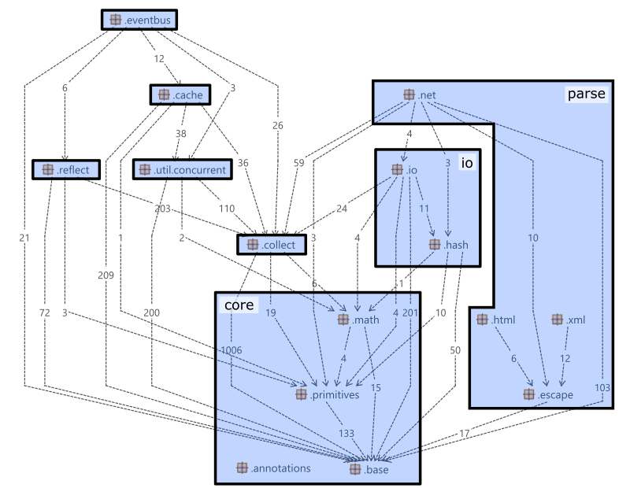

# Durian: Guava's spikier (unofficial) cousin

Durian has two branches:

- [master-guava](https://github.com/diffplug/durian/tree/master-guava) maintains Google's Guava exactly as published by Google, but split into separate packages, so that you can grab its packages a la carte.
- [master-durian](https://github.com/diffplug/durian/tree/master-durian) maintains a fork of Guava where all JRE duplicate classes (Function, Optional, etc) have been replaced with their Java 8 equivalents.  Additional utilities useful for Java 8's method references and closures have been added.  It uses semantic versioning, and can be used alongside Guava.

See [this blog post TODO] for a full (but brief) motivation.  Here are a few of the most useful pieces which have been added:

- [One-liner exception handling TODO] for Java 8 functional interfaces.
- [Member variables TODO] for Java 8 lambdas.
- A [simple replacement TODO] for the mess of `PrintStream`, `Writer`, etc when you just want to pipe some strings around.
- Guava's `Suppliers`, `Predicates`, and `Functions` converted to Java 8, and a `Consumers` class to round it out.

## Branch `master-guava`, maven group `com.diffplug.guava`

This group contains Guava exactly as published by Google, but split into separate packages according to this graph:

These are maintained on Maven Central from Guava R19 forward.

<!---freshmark guava
var kinds = ['core', 'collect', 'io', 'parse', 'reflect', 'testlib', 'concurrent', 'eventbus', 'cache']
var mavenCentral = function(kind) {
	return link('com.diffplug.guava:guava-' + kind, 'https://search.maven.org/#search%7Cgav%7C1%7Cg%3A%22com.diffplug.guava%22%20AND%20a%3A%22guava-' + kind + '%22')
}
output = kinds.map(mavenCentral).join('\n')
-->
[com.diffplug.guava:guava-core](https://search.maven.org/#search%7Cgav%7C1%7Cg%3A%22com.diffplug.guava%22%20AND%20a%3A%22guava-core%22)
[com.diffplug.guava:guava-collect](https://search.maven.org/#search%7Cgav%7C1%7Cg%3A%22com.diffplug.guava%22%20AND%20a%3A%22guava-collect%22)
[com.diffplug.guava:guava-io](https://search.maven.org/#search%7Cgav%7C1%7Cg%3A%22com.diffplug.guava%22%20AND%20a%3A%22guava-io%22)
[com.diffplug.guava:guava-parse](https://search.maven.org/#search%7Cgav%7C1%7Cg%3A%22com.diffplug.guava%22%20AND%20a%3A%22guava-parse%22)
[com.diffplug.guava:guava-reflect](https://search.maven.org/#search%7Cgav%7C1%7Cg%3A%22com.diffplug.guava%22%20AND%20a%3A%22guava-reflect%22)
[com.diffplug.guava:guava-testlib](https://search.maven.org/#search%7Cgav%7C1%7Cg%3A%22com.diffplug.guava%22%20AND%20a%3A%22guava-testlib%22)
[com.diffplug.guava:guava-concurrent](https://search.maven.org/#search%7Cgav%7C1%7Cg%3A%22com.diffplug.guava%22%20AND%20a%3A%22guava-concurrent%22)
[com.diffplug.guava:guava-eventbus](https://search.maven.org/#search%7Cgav%7C1%7Cg%3A%22com.diffplug.guava%22%20AND%20a%3A%22guava-eventbus%22)
[com.diffplug.guava:guava-cache](https://search.maven.org/#search%7Cgav%7C1%7Cg%3A%22com.diffplug.guava%22%20AND%20a%3A%22guava-cache%22)
<!---freshmark /guava -->

## Branch `master-durian`, maven group `com.diffplug.durian`

In this branch, we've taken the code in Guava, and removed all the classes which have been adopted by the JRE.  We've also removed all deprecated functionality, and added some new functionality which is helpful for Java 8 (e.g. collectors for immutable collections).

<!---freshmark durian
var kinds = ['core', 'collect', 'io', 'parse', 'reflect', 'testlib', 'concurrent', 'eventbus', 'cache']
var mavenCentral = function(kind) {
	return link('com.diffplug.durian:durian-' + kind, 'https://search.maven.org/#search%7Cgav%7C1%7Cg%3A%22com.diffplug.durian%22%20AND%20a%3A%22durian-' + kind + '%22')
}
output = kinds.map(mavenCentral).join('\n')
-->
[com.diffplug.durian:durian-core](https://search.maven.org/#search%7Cgav%7C1%7Cg%3A%22com.diffplug.durian%22%20AND%20a%3A%22durian-core%22)
[com.diffplug.durian:durian-collect](https://search.maven.org/#search%7Cgav%7C1%7Cg%3A%22com.diffplug.durian%22%20AND%20a%3A%22durian-collect%22)
[com.diffplug.durian:durian-io](https://search.maven.org/#search%7Cgav%7C1%7Cg%3A%22com.diffplug.durian%22%20AND%20a%3A%22durian-io%22)
[com.diffplug.durian:durian-parse](https://search.maven.org/#search%7Cgav%7C1%7Cg%3A%22com.diffplug.durian%22%20AND%20a%3A%22durian-parse%22)
[com.diffplug.durian:durian-reflect](https://search.maven.org/#search%7Cgav%7C1%7Cg%3A%22com.diffplug.durian%22%20AND%20a%3A%22durian-reflect%22)
[com.diffplug.durian:durian-testlib](https://search.maven.org/#search%7Cgav%7C1%7Cg%3A%22com.diffplug.durian%22%20AND%20a%3A%22durian-testlib%22)
[com.diffplug.durian:durian-concurrent](https://search.maven.org/#search%7Cgav%7C1%7Cg%3A%22com.diffplug.durian%22%20AND%20a%3A%22durian-concurrent%22)
[com.diffplug.durian:durian-eventbus](https://search.maven.org/#search%7Cgav%7C1%7Cg%3A%22com.diffplug.durian%22%20AND%20a%3A%22durian-eventbus%22)
[com.diffplug.durian:durian-cache](https://search.maven.org/#search%7Cgav%7C1%7Cg%3A%22com.diffplug.durian%22%20AND%20a%3A%22durian-cache%22)
<!---freshmark /durian -->

### Duplicated pieces which have been removed

TODO: commits where the stuff was added

- Replaced `com.google.common.base.Objects` with `j.u.Objects`.
- Replaced `com.google.common.base.Supplier` with `j.u.f.Supplier`.
- Replaced `com.google.common.base.Function` with `j.u.f.Function`.
- Replaced `com.google.common.base.Predicate` with `j.u.f.Predicate`.
- Replaced `com.google.common.base.Optional` with `j.u.Optional`.
- Replaced `com.google.common.base.Charsets` with `j.u.StandardCharsets`.
- Replaced `com.google.common.collect.Iterators.emptyIterator()` with `j.u.Iterators.emptyIterator`
- Replaced `com.google.common.collect.Sets.newSetFromMap()` with `j.u.Collections.newSetFromMap()`
- Replaced `com.google.common.collect.Sets.newSetFromMap()` with `j.u.Collections.newSetFromMap()`

### New pieces which have been added

- TODO
